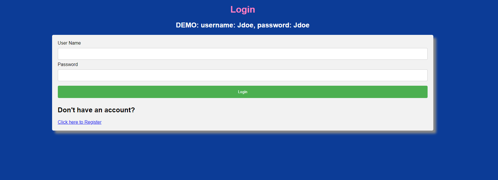
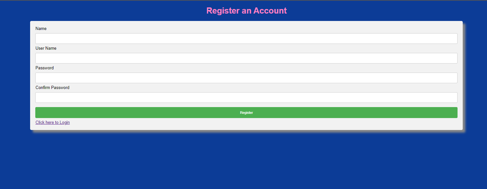
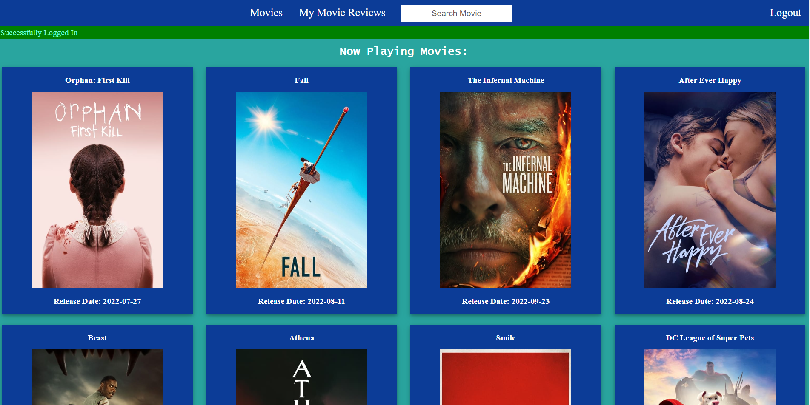
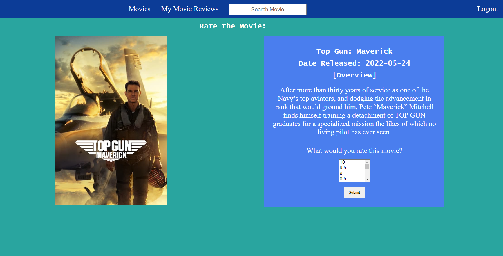
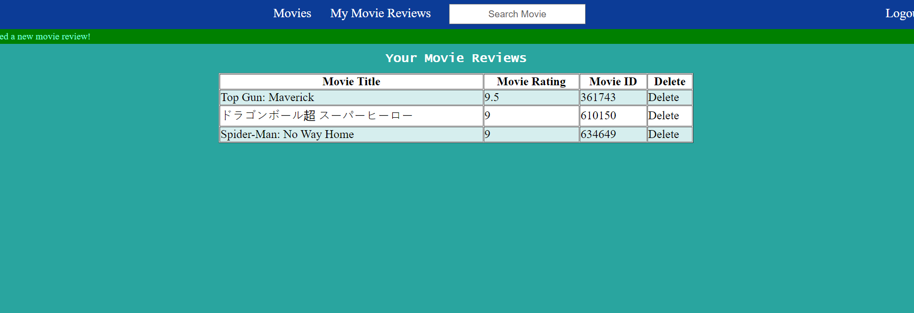

# Movie Review Web App
### A web app made using nodejs and a movie api that lets the user search movies and rate them on a scale of 1-10. The user's ratings are saved in a SQL database and can be viewed in a list.

---
## Login Page:

## Register Account Page:

## Main Page:

## Rate your Movie Page:

## Your Rated Movie List:

Sources/ References :

express: The Web Developer Bootcamp 2021 Sections: 33,34
https://www.w3schools.com/nodejs/nodejs_mysql_update.asp

https://www.youtube.com/watch?v=XH5OW46yO8I&ab_channel=FlorinPop

